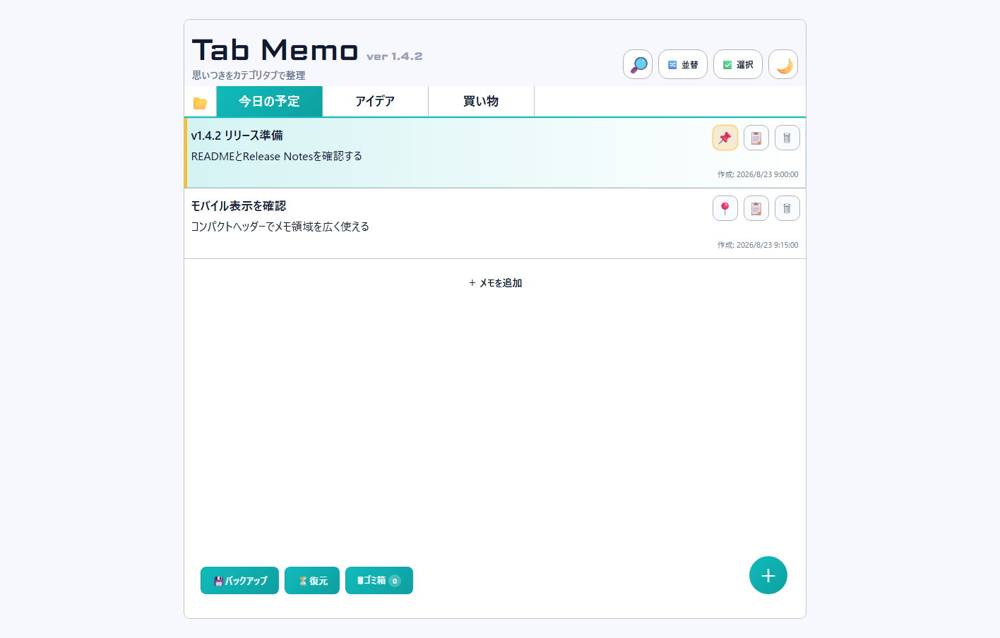
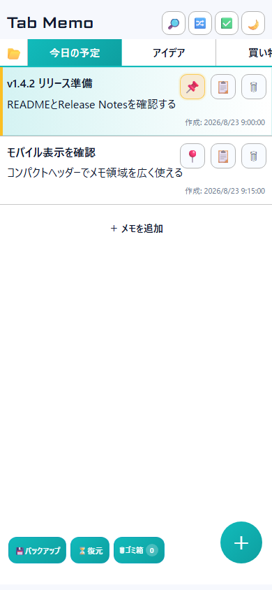

# 📒 TabMemo



---

## 🇯🇵 日本語

### 概要
Tab Memo は、カテゴリタブでメモを切り替えて管理できる PWA です。  
インストール不要の[Web版（GitHub Pages）](https://chimozaki.github.io/tabmemo/)をすぐに利用できます。
`start_tabmemo.bat` から起動すると、ブラウザに依存しないローカルJSONへ自動保存します。  
`index.html` を直接開く従来方式も利用できます。  
オフラインでも使える設計です。

> [!IMPORTANT]
> **Web版**はNode.js不要で、データを利用中のブラウザ内に保存します。
> **ローカルJSON版**は `start_tabmemo.bat` から起動し、Node.jsを使用します。同じPCの別ブラウザでもデータを共有できます。

### 主な機能
- 📂 カテゴリタブ切り替え（横スクロール・スワイプ対応）
- 📝 メモ作成・編集（タイトル + 本文）
- 📌 ピン留め、並べ替え、複数選択、本文ワンクリックコピー
- 🗑 メモ・カテゴリのゴミ箱、個別復元、完全削除
- 🛡 未保存の変更を検知し、保存・破棄・編集継続を選択
- 🔎 全カテゴリ横断検索
- 🎨 ライト / ダークテーマ切替
- 💽 ブラウザ間で共有できるローカルJSON自動保存
- 💾 JSON バックアップ・復元
- 📶 Service Worker によるオフライン対応
- 📱 320px幅から使えるモバイルレイアウト。タイトルと操作を1段へ圧縮し、メモ領域を優先
- 🌐 GitHub Pagesで利用できるインストール不要のWeb版
- 🕘 バックアップ画面に最終バックアップ日時を表示

### 使い方
#### Web版を使う

1. [TabMemo Web版](https://chimozaki.github.io/tabmemo/)を開きます。
2. 作成したデータはそのブラウザ内へ自動保存されます。
3. 必要に応じて「💾バックアップ」からJSONを書き出してください。

PC内のJSONファイルへ保存したい場合や、複数のブラウザで同じデータを使いたい場合は、以下のローカルJSON版を利用します。

#### 1. Node.jsを準備する（初回だけ）

1. まず `start_tabmemo.bat` をダブルクリックしてください。Tab Memoが開けば、Node.jsは導入済みなので次の「2. Tab Memoを起動する」へ進めます。
2. 黒い画面に「Node.js is not installed...」と表示された場合は、[Node.js公式ダウンロードページ](https://nodejs.org/en/download)を開きます。
3. **LTS（長期サポート版）**を選び、Windows用のインストーラー（`.msi`）をダウンロードします。「Current」ではなく「LTS」を選べば大丈夫です。
4. ダウンロードした `.msi` ファイルをダブルクリックします。
5. インストーラーは、特に変更せず `Next` → 利用規約に同意 → `Next` → `Install` → `Finish` の順に進めます。
6. 開いている黒い画面を閉じ、もう一度 `start_tabmemo.bat` をダブルクリックします。それでも認識されない場合は、Windowsを再起動してから再度お試しください。

確認したい場合は、スタートメニューで「コマンドプロンプト」を開き、次を入力します。

```text
node -v
```

`v24...` のように `v` から始まる番号が表示されれば準備完了です。バージョン番号は例と違っていても問題ありません。Tab Memoでは `npm install` などの追加操作は不要です。

#### 2. Tab Memoを起動する

1. GitHubからZIPをダウンロードした場合は、ZIPを右クリックして「すべて展開」します。ZIPの中から直接起動しないでください。
2. 展開したTab Memoフォルダを開きます。
3. `start_tabmemo.bat` をダブルクリックします。
4. 黒いサーバー画面と、ブラウザの `http://localhost:4174/` が自動で開きます。
5. Tab Memoの使用中は黒いサーバー画面を閉じないでください。閉じるとローカルJSONへの保存が止まります。
6. 以前 `index.html` を直接使っていた場合は、初回だけ以前のJSONバックアップを「復元」します。

> [!TIP]
> 次回からも `index.html` やブラウザのお気に入りだけで起動せず、先に `start_tabmemo.bat` をダブルクリックしてください。Node.jsの導入に料金やユーザー登録は必要ありません。

#### 起動できないとき

- 「`node` が見つからない」などと表示される: Windowsを再起動してください。直らなければNode.jsのLTS版を再インストールします。
- BATを押してもブラウザが開かない: 残っている「TabMemo - Local Server」という黒い画面を閉じてから、BATをもう一度実行します。
- 黒い画面がすぐ閉じる: `start_tabmemo.bat` と `server.js` が同じフォルダにあるか確認します。ZIP内のファイルをすべて一緒に展開してください。
- 急いでメモを確認したい: `index.html` の直接起動もできますが、その場合のデータは開いたブラウザ内だけに保存されます。

### データ保存
- 本データ: `data/tabmemo-data.json`
- 直前版: `data/tabmemo-data.previous.json`
- ブラウザキャッシュ: `localStorage`（キー: `tabMemoPwa_v2_0`）
- 別ブラウザでも、同じBATから起動すれば共通のローカルJSONを読み込みます
- `index.html` を直接開いた場合はブラウザ保存のみで動作します
- GitHub Pages版もブラウザ保存で動作し、Node.jsは不要です
- ゴミ箱の内容も通常データ・JSONバックアップに含まれます

### ファイル構成
- `start_tabmemo.bat` : 推奨起動ファイル
- `server.js` : ローカルJSONの読込・保存サーバー
- `data/` : メモデータと直前版の保存先（初回保存時に自動作成）
- `index.html` : UI 本体
- `app.js` : アプリロジック
- `style.css` : スタイル定義
- `sw.js` : Service Worker
- `manifest.json` : PWA マニフェスト
- `icon.svg` / `icon-maskable.svg` : アイコン

### リリース状態
現在の正式版は **ver1.4.2** です。

## ☕ Support

このプロジェクトが役に立った場合は、Ko-fiで今後の開発を応援していただけると嬉しいです。

☕ https://ko-fi.com/puniq

ご支援ありがとうございます！

---

## 🇬🇧 English

### Overview
Tab Memo is a PWA that lets you organize memos with category tabs.  
You can immediately use the installation-free [web version on GitHub Pages](https://chimozaki.github.io/tabmemo/).
Launch with `start_tabmemo.bat` to automatically save to a browser-independent local JSON file.  
Direct `index.html` use remains available as a browser-storage fallback.  
It is designed to work offline.

> [!IMPORTANT]
> The **web version** requires no Node.js and stores data in the current browser.
> The **local JSON version** starts with `start_tabmemo.bat`, uses Node.js, and can share data between browsers on the same PC.

### Features
- 📂 Category tabs (horizontal scroll + swipe support)
- 📝 Create and edit memos (title + body)
- 📌 Pin, reorder, multi-select, and one-click body copy
- 🗑 Trash, restore, and permanently delete memos and categories
- 🛡 Detect unsaved edits and choose Save, Discard, or Continue editing
- 🔎 Search across all categories
- 🎨 Light / dark theme toggle
- 💽 Automatic local JSON storage shared across browsers
- 💾 JSON backup and restore
- 📶 Offline support via Service Worker
- 📱 Mobile layout from 320px with a compact single-row header that prioritizes memo space
- 🌐 Installation-free web version on GitHub Pages
- 🕘 Last backup time shown in the backup dialog

### Quick Start
#### Use the web version

1. Open [TabMemo Web](https://chimozaki.github.io/tabmemo/).
2. Your data is saved automatically in that browser.
3. Export a JSON file from “💾 Backup” whenever you need a portable copy.

Use the local JSON version below when you want a file stored on your PC or shared data across browsers.

#### 1. Install Node.js (first time only)

1. First, double-click `start_tabmemo.bat`. If Tab Memo opens, Node.js is already installed; continue to step 2 below.
2. If the black window says “Node.js is not installed...”, open the [official Node.js download page](https://nodejs.org/en/download).
3. Choose the **LTS (Long-Term Support)** release and download the Windows installer (`.msi`). Choose “LTS,” not “Current.”
4. Run the downloaded `.msi` file and proceed with the default options: `Next` → accept the license → `Next` → `Install` → `Finish`.
5. Close the black window and double-click `start_tabmemo.bat` again. If Node.js is still not detected, restart Windows and try again.

To verify the installation, open Command Prompt from the Start menu and enter:

```text
node -v
```

If a number beginning with `v` appears, Node.js is ready. No `npm install` or other package installation is required.

#### 2. Start Tab Memo

1. If you downloaded a ZIP from GitHub, right-click it and select “Extract All.” Do not run Tab Memo from inside the ZIP.
2. Open the extracted Tab Memo folder.
3. Double-click `start_tabmemo.bat`.
4. A server window and `http://localhost:4174/` will open automatically.
5. Keep the server window open while using Tab Memo; closing it stops local JSON storage.
6. If you previously used `index.html` directly, restore your previous JSON backup once.

> [!TIP]
> Always start with `start_tabmemo.bat`, even if you bookmarked the browser page. Node.js is free and does not require an account.

#### Troubleshooting

- “`node` was not found”: Restart Windows. If that does not help, reinstall the Node.js LTS release.
- The browser does not open: Close any remaining “TabMemo - Local Server” windows and run the BAT again.
- The black window closes immediately: Confirm that `start_tabmemo.bat` and `server.js` are in the same fully extracted folder.
- Need quick access: You can open `index.html` directly, but its data is stored only in that browser.

### Data Storage
- Primary data: `data/tabmemo-data.json`
- Previous version: `data/tabmemo-data.previous.json`
- Browser cache: `localStorage` (key: `tabMemoPwa_v2_0`)
- Browsers share the same local JSON when launched through the BAT file
- Direct `index.html` use falls back to browser-only storage
- The GitHub Pages version also uses browser storage and requires no Node.js
- Trash contents are included in normal storage and JSON backups

### Project Files
- `start_tabmemo.bat` : Recommended launcher
- `server.js` : Local JSON read/write server
- `data/` : Memo data and previous-version storage (created automatically)
- `index.html` : Main UI
- `app.js` : App logic
- `style.css` : Styles
- `sw.js` : Service Worker
- `manifest.json` : PWA manifest
- `icon.svg` / `icon-maskable.svg` : Icons

### Release Status
Current stable release is **ver1.4.2**.

## ☕ Support

If you find this project useful and would like to support future development, you can support me on Ko-fi.

☕ https://ko-fi.com/puniq

Thank you for your support!
---

## 🇹🇼 繁體中文

### 概要
Tab Memo 是一款可用分類分頁管理備忘錄的 PWA。  
可立即使用免安裝的 [GitHub Pages 網頁版](https://chimozaki.github.io/tabmemo/)。
使用 `start_tabmemo.bat` 啟動時，資料會自動儲存到不依賴瀏覽器的本機 JSON。  
仍可直接開啟 `index.html`，此時會使用瀏覽器儲存空間。  
以離線可用為設計核心。

> [!IMPORTANT]
> **網頁版**不需要Node.js，資料會儲存在目前使用的瀏覽器中。
> **本機JSON版**使用 `start_tabmemo.bat` 與Node.js，可在同一台PC的不同瀏覽器間共用資料。

### 主要功能
- 📂 分類分頁切換（支援橫向捲動與滑動）
- 📝 新增與編輯備忘錄（標題 + 內容）
- 📌 釘選、重新排序、多選及一鍵複製內容
- 🗑 備忘錄與分類的垃圾桶、還原及永久刪除
- 🛡 偵測未儲存變更，可選擇儲存、放棄或繼續編輯
- 🔎 跨分類全文搜尋
- 🎨 淺色 / 深色主題切換
- 💽 可在不同瀏覽器間共用的本機JSON自動儲存
- 💾 JSON 備份與還原
- 📶 透過 Service Worker 支援離線使用
- 📱 支援最小320px寬度，使用單列精簡標頭優先保留備忘錄空間
- 🌐 可於GitHub Pages使用的免安裝網頁版
- 🕘 在備份視窗顯示上次備份時間

### 快速開始
#### 使用網頁版

1. 開啟 [TabMemo網頁版](https://chimozaki.github.io/tabmemo/)。
2. 資料會自動儲存在該瀏覽器中。
3. 需要可攜式副本時，請從「💾備份」匯出JSON。

若要將JSON檔案儲存在PC上，或在不同瀏覽器間共用資料，請使用下方的本機JSON版。

#### 1. 安裝Node.js（只需首次操作）

1. 先雙擊 `start_tabmemo.bat`。如果Tab Memo正常開啟，表示已安裝Node.js，可直接進入下一節。
2. 如果黑色視窗顯示「Node.js is not installed...」，請開啟[Node.js官方下載頁面](https://nodejs.org/en/download)。
3. 選擇 **LTS（長期支援版）**，下載Windows安裝程式（`.msi`）。請選擇「LTS」，不要選擇「Current」。
4. 執行下載的 `.msi`，使用預設選項依序按下 `Next`、同意授權條款、`Next`、`Install`、`Finish`。
5. 關閉黑色視窗，再次雙擊 `start_tabmemo.bat`。如果仍無法辨識Node.js，請重新啟動Windows後再試。

如需確認，請從開始功能表開啟「命令提示字元」，輸入 `node -v`。顯示以 `v` 開頭的版本號即表示安裝完成。不需要執行 `npm install`。

#### 2. 啟動Tab Memo

1. 如果從GitHub下載ZIP，請右鍵選擇「全部解壓縮」，不要直接從ZIP內執行。
2. 開啟解壓縮後的Tab Memo資料夾。
3. 雙擊 `start_tabmemo.bat`。
4. 黑色伺服器視窗與 `http://localhost:4174/` 會自動開啟。
5. 使用Tab Memo期間請勿關閉黑色視窗，否則本機JSON儲存會停止。
6. 以前若直接使用 `index.html`，首次請從原有JSON備份還原資料。

> [!TIP]
> 之後也請先執行 `start_tabmemo.bat`，不要只使用瀏覽器書籤。Node.js免費且不需要註冊帳號。

#### 無法啟動時

- 找不到「`node`」：重新啟動Windows；若仍無法使用，請重新安裝Node.js LTS版。
- 瀏覽器未開啟：關閉殘留的「TabMemo - Local Server」黑色視窗，再次執行BAT。
- 黑色視窗立即關閉：確認 `start_tabmemo.bat` 與 `server.js` 位於同一個已完整解壓縮的資料夾。
- 急需查看備忘錄：可直接開啟 `index.html`，但資料只會儲存在該瀏覽器中。

### 資料儲存
- 主要資料: `data/tabmemo-data.json`
- 上一版本: `data/tabmemo-data.previous.json`
- 瀏覽器快取: `localStorage`（金鑰: `tabMemoPwa_v2_0`）
- 透過 BAT 啟動時，不同瀏覽器會共用同一個本機 JSON
- GitHub Pages版使用瀏覽器儲存，不需要Node.js
- 垃圾桶內容也包含在一般儲存與JSON備份中

### 檔案結構
- `start_tabmemo.bat` : 建議使用的啟動檔案
- `server.js` : 本機JSON讀寫伺服器
- `data/` : 備忘錄資料與上一版本的儲存位置（首次儲存時自動建立）
- `index.html` : 主要 UI
- `app.js` : 應用邏輯
- `style.css` : 樣式
- `sw.js` : Service Worker
- `manifest.json` : PWA Manifest
- `icon.svg` / `icon-maskable.svg` : 圖示

### 發行狀態
目前正式版本為 **ver1.4.2**。

## ☕ Support

如果這個專案對您有幫助，歡迎透過 Ko-fi 支持後續開發。

☕ https://ko-fi.com/puniq

感謝您的支持！
---

## 🇪🇸 Español

### Resumen
Tab Memo es una PWA para organizar notas con pestañas por categoría.  
Puedes usar inmediatamente la [versión web en GitHub Pages](https://chimozaki.github.io/tabmemo/) sin instalar nada.
Al iniciarla con `start_tabmemo.bat`, los datos se guardan automáticamente en un JSON local independiente del navegador.  
También se puede abrir `index.html` directamente usando el almacenamiento del navegador.  
Está diseñada para funcionar también sin conexión.

> [!IMPORTANT]
> La **versión web** no requiere Node.js y guarda los datos en el navegador actual.
> La **versión JSON local** se inicia con `start_tabmemo.bat`, usa Node.js y permite compartir datos entre navegadores del mismo PC.

### Funciones
- 📂 Pestañas por categoría (scroll horizontal y deslizamiento)
- 📝 Crear y editar notas (título + contenido)
- 📌 Fijar, reordenar, seleccionar varias y copiar el contenido con un clic
- 🗑 Papelera, restauración y eliminación permanente de notas y categorías
- 🛡 Detección de cambios sin guardar con opciones para guardar, descartar o seguir editando
- 🔎 Búsqueda en todas las categorías
- 🎨 Cambio entre tema claro y oscuro
- 💽 Almacenamiento JSON local automático compartido entre navegadores
- 💾 Respaldo y restauración en JSON
- 📶 Soporte offline mediante Service Worker
- 📱 Diseño móvil desde 320px con una cabecera compacta de una fila que prioriza el espacio para notas
- 🌐 Versión web sin instalación en GitHub Pages
- 🕘 Fecha y hora del último respaldo en el diálogo de respaldo

### Inicio rápido
#### Usar la versión web

1. Abre [TabMemo Web](https://chimozaki.github.io/tabmemo/).
2. Los datos se guardan automáticamente en ese navegador.
3. Exporta un JSON desde «💾 Respaldo» cuando necesites una copia portátil.

Usa la versión JSON local que aparece a continuación si quieres guardar un archivo en el PC o compartir datos entre navegadores.

#### 1. Instalar Node.js (solo la primera vez)

1. Primero, haz doble clic en `start_tabmemo.bat`. Si Tab Memo se abre, Node.js ya está instalado; continúa con la siguiente sección.
2. Si la ventana negra indica “Node.js is not installed...”, abre la [página oficial de descarga de Node.js](https://nodejs.org/en/download).
3. Elige la versión **LTS (soporte a largo plazo)** y descarga el instalador de Windows (`.msi`). Elige “LTS”, no “Current”.
4. Ejecuta el archivo `.msi` y conserva las opciones predeterminadas: `Next` → aceptar la licencia → `Next` → `Install` → `Finish`.
5. Cierra la ventana negra y vuelve a ejecutar `start_tabmemo.bat`. Si Node.js sigue sin detectarse, reinicia Windows e inténtalo otra vez.

Para comprobarlo, abre el Símbolo del sistema desde Inicio y escribe `node -v`. Si aparece un número que empieza por `v`, la instalación está lista. No necesitas ejecutar `npm install`.

#### 2. Iniciar Tab Memo

1. Si descargaste un ZIP desde GitHub, haz clic derecho y selecciona “Extraer todo”. No lo ejecutes dentro del ZIP.
2. Abre la carpeta extraída de Tab Memo.
3. Haz doble clic en `start_tabmemo.bat`.
4. Se abrirán automáticamente una ventana negra del servidor y `http://localhost:4174/`.
5. Mantén abierta la ventana del servidor mientras uses Tab Memo; si la cierras, se detendrá el almacenamiento JSON local.
6. Si antes usabas `index.html` directamente, restaura una vez tu copia de seguridad JSON anterior.

> [!TIP]
> Inicia siempre con `start_tabmemo.bat`, aunque hayas guardado la página en favoritos. Node.js es gratuito y no requiere una cuenta.

#### Solución de problemas

- No se encuentra “`node`”: Reinicia Windows. Si no se soluciona, reinstala la versión LTS de Node.js.
- El navegador no se abre: Cierra las ventanas “TabMemo - Local Server” que queden abiertas y ejecuta de nuevo el BAT.
- La ventana negra se cierra inmediatamente: Comprueba que `start_tabmemo.bat` y `server.js` estén juntos en la carpeta completamente extraída.
- Acceso rápido: Puedes abrir `index.html` directamente, pero sus datos solo se guardarán en ese navegador.

### Almacenamiento
- Datos principales: `data/tabmemo-data.json`
- Versión anterior: `data/tabmemo-data.previous.json`
- Caché del navegador: `localStorage` (clave: `tabMemoPwa_v2_0`)
- Los navegadores comparten el mismo JSON local al iniciar mediante el BAT
- La versión de GitHub Pages usa almacenamiento del navegador y no requiere Node.js
- El contenido de la papelera se incluye en el almacenamiento normal y en los respaldos JSON

### Estructura del proyecto
- `start_tabmemo.bat` : Iniciador recomendado
- `server.js` : Servidor local de lectura y escritura JSON
- `data/` : Datos de notas y versión anterior (se crea automáticamente)
- `index.html` : UI principal
- `app.js` : Lógica de la app
- `style.css` : Estilos
- `sw.js` : Service Worker
- `manifest.json` : Manifiesto PWA
- `icon.svg` / `icon-maskable.svg` : Iconos

### Estado de lanzamiento
La versión estable actual es **ver1.4.2**.

## ☕ Support

Si este proyecto te resulta útil y deseas apoyar su desarrollo futuro, puedes apoyarme en Ko-fi.

☕ https://ko-fi.com/puniq

¡Muchas gracias por tu apoyo!
